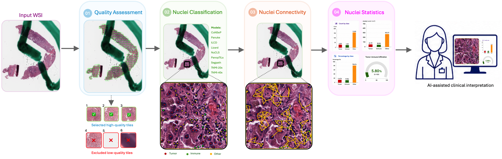
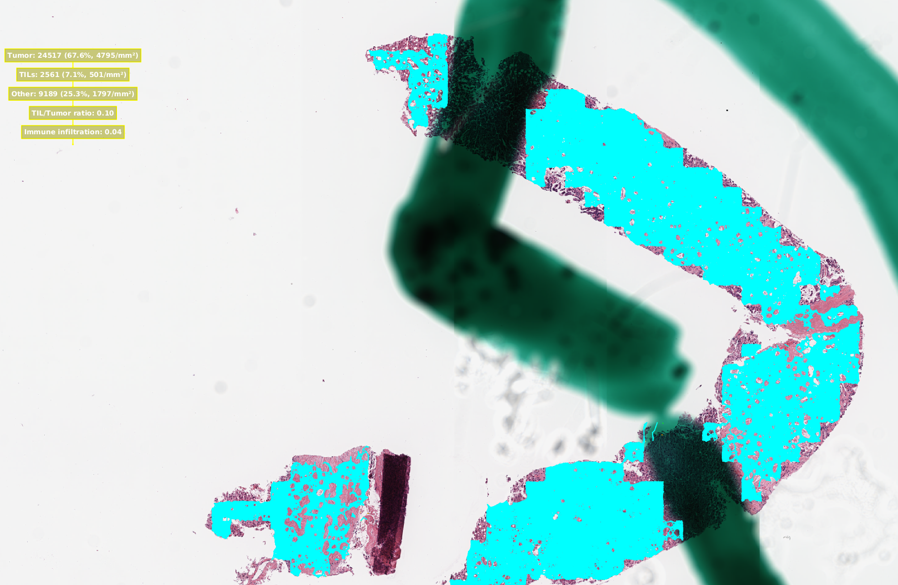

# CellQuant-Net



<p align="justify">  </p>

Check out the paper: [Paper]

# Setting Up the Pipeline:

1. System requirements:
- Ubuntu 20.04 or 22.04
- CUDA version: 12.8
- Python version: 3.9 (using conda environments)
- Anaconda version 23.7.4
2. Steps to Set Up the Pipeline:
- Open terminal 
- `cd ~/Desktop`
- `git clone https://github.com/Falah-Jabar-Rahim/CellQuant-Net-End-to-End-Nuclei-Quantification-in-H-E-Whole-Slide-Images.git CellQuant-Net`
- `cd CellQuant-Net`
- `chmod +x install.sh`
- `./install.sh`
- `conda activate cellquantnet`
- `python verify_installation.py`

# Quick Test:
- Downlaod a [test WSI](https://portal.gdc.cancer.gov/files/5bd34bab-6a75-4d62-ab9d-0ada84414776)
- Place the downloaded WSI in the input folder
- Run CellQuant-Net: `python run_cellquant_net.py  --cpu_workers 32  --batch_size 128 --cell_connectivity   --model_type TNMI20x.pth`

# 🎥 Watch the Demo:
[](https://youtu.be/RhCJnUfuYkA?is=Jc4keTUtecEcjeZd)


# Pre-trained Models
| Dataset | Type | Magnification |
|----------|--------|---------------|
| PanNuke | Multi-organ |  40× |
| CoNSeP | Single-organ |  40× |
| ILCD | Single-organ |  40× |
| Lizard | Single-organ |  20× |
| NuCLS | Single-organ |  20× |
| PanopTILs | Single-organ |  40× |
| SegPath | Multi-organ |  40× |
| TNMI20x | Single-organ |  20× |
| TNMI40x | Single-organ |  40× |

Contact the corresponding author to request access to the pre-trained models

# Output Structure

After running CellQuant-Net, all results are saved in the output directory:

### Quality Assessment (QA) Output
```text
output/
└── QA/
    ├── WSI1/
    ├── WSI2/
    ├── ...
    └── WSI_Summary.xlsx
```

- Place your Whole Slide Image (WSI) into the `test_wsi` folder
- The pre-trained weights for artifact detection are available in the `pretrained_ckpt` folder, while the weights for pen-marker removal are located in the `Ink_Removal/pre-trained` folder
- In the terminal execute:
  `python test_wsi.py`

- After running the inference, you will obtain the following outputs in `test_wsi` folder:
    - A thumbnail image of WSI
    - A thumbnail image of WSI with regions of interest (ROI) identified
    - A segmentation mask highlighting segmented regions of the WSI [Qualifed tissue: green, fold: red, blur: orange, and background: black]
    - A segmentation mask highlighting only qualified tissue regions of the WSI [background:0, qualified tissue:1]
    - Excel files contain statistics on identified artifacts
    - A folder named Selected_tiles containing qualified tiles

  

# Acknowledgment:

Some parts of this pipeline were adapted from work on [GitHub](https://github.com/pengsl-lab/DHUnet) and [GitHub](https://github.com/Vishwesh4/Ink-WSI). If you use this pipeline, please make sure to cite their work properly

# Citation:


# Contact:

If you have any questions or comments, please feel free to contact: falah.rahim@unn.no

